# AI Study Hub — Documentation Index

Tài liệu dự án được chia thành 4 nhóm chính. Source code (`src/`) luôn là nguồn đúng nhất khi docs và code lệch nhau.

## Cấu Trúc Docs

```mermaid
graph TD
  Root["docs/"]
  Project["project/"]
  Architecture["architecture/"]
  Plans["plans/"]
  EndpointFlows["endpoint-flows/"]
  Assets["assets/"]
  Diagrams["diagrams/"]

  Root --> Project
  Root --> Architecture
  Root --> Plans
  Root --> EndpointFlows
  Root --> Assets
  Root --> Diagrams

  Project --> P1["context.md — Bối cảnh + user stories"]
  Project --> P2["description-report.md — Báo cáo thuyết trình"]
  Project --> P3["ProjectDescription.docx — File Word"]

  Architecture --> A1["system-architecture.md — Kiến trúc runtime"]
  Architecture --> A2["database-entities.md — Thiết kế DB v2.1"]
  Architecture --> A3["api-specification.md — API spec chi tiết"]
  Architecture --> A4["validation-error-flow.md — Validation + error"]
  Architecture --> A5["service-helpers.md — Helper dùng chung trong service layer"]

  Plans --> PL1["async-extraction-ocr.md — Kế hoạch async extraction"]
  Plans --> PL2["text-chunking-plan.md — Kế hoạch chia nhỏ extracted text"]

  EndpointFlows --> EF1["README.md — Index + status bảng"]
  EndpointFlows --> EF2["01–13 endpoint flow files"]

  Assets --> AS1["system-architecture/ — Badge PNG"]
  Assets --> AS2["image-sources.md — Nguồn ảnh"]

  Diagrams --> D1["context-diagram.mmd"]
  Diagrams --> D2["system-architecture.mmd"]
```

## Nhóm Docs

### 📋 project/ — Tài liệu sản phẩm

Bối cảnh dự án, user stories, và tài liệu báo cáo/thuyết trình.

| File                                                   | Mục đích                                                           |
| ------------------------------------------------------ | ------------------------------------------------------------------ |
| [context.md](project/context.md)                       | Bối cảnh dự án, mục tiêu, phạm vi features, user stories US01-US25 |
| [description-report.md](project/description-report.md) | Mô tả dự án dạng báo cáo/thuyết trình formal (có placeholders)     |
| ProjectDescription.docx                                | Phiên bản Word của báo cáo                                         |

### 🏗️ architecture/ — Kiến trúc kỹ thuật

Runtime architecture, database design, API spec, và validation flow. Source code (`src/`) là nguồn đúng nhất — đọc docs này để hiểu tổng quan, nhưng khi có conflict thì tin code.

| File                                                              | Mục đích                                                                                                | Lưu ý                                                                                               |
| ----------------------------------------------------------------- | ------------------------------------------------------------------------------------------------------- | --------------------------------------------------------------------------------------------------- |
| [system-architecture.md](architecture/system-architecture.md)     | Kiến trúc Express app, request lifecycle, route map, DB collections, upload/text extraction, deployment | Source of truth cho kiến trúc runtime                                                               |
| [database-entities.md](architecture/database-entities.md)         | Thiết kế 12 collections MongoDB v2.1, relationships, indexes, strategies                                | Viết "Mongoose" ở title nhưng source dùng MongoDB native driver. Nhiều indexes chưa có trong source |
| [api-specification.md](architecture/api-specification.md)         | API spec chi tiết cho toàn bộ endpoints (89KB)                                                          | Bao gồm cả endpoints planned/chưa implement. Đối chiếu `src/app.ts` và `src/routes`                 |
| [validation-error-flow.md](architecture/validation-error-flow.md) | Chi tiết `validate`, `wrapAsync`, `ErrorWithStatus`, `EntityErr`, `defautHandler`                       | Dành riêng cho validation/error handling patterns                                                   |
| [service-helpers.md](architecture/service-helpers.md)             | Mô tả `src/services/helpers`, các helper dùng chung và quy tắc không nên gom quá tay                    | Dành cho refactor service layer                                                                     |

### 🚀 plans/ — Kế hoạch phát triển

Tài liệu roadmap và implementation plan cho features tương lai.

| File                                                     | Mục đích                                                                                                |
| -------------------------------------------------------- | ------------------------------------------------------------------------------------------------------- |
| [async-extraction-ocr.md](plans/async-extraction-ocr.md) | Kế hoạch chuyển text extraction sang async, OCR roadmap, worker design                                  |
| [text-chunking-plan.md](plans/text-chunking-plan.md)     | Kế hoạch chia nhỏ extracted/OCR text để tránh phình `solutions.extractedText` và chuẩn bị cho search/AI |

### 📡 endpoint-flows/ — Flow chi tiết từng nhóm endpoint

Tách nhỏ theo chức năng. Xem [endpoint-flows/README.md](endpoint-flows/README.md) để biết status bảng (implemented/planned/partial).

### 📁 assets/ và diagrams/

- `assets/system-architecture/`: badge PNG cho tech stack
- `assets/image-sources.md`: nguồn và license ảnh web dùng trong docs
- `diagrams/`: Mermaid source files (`.mmd`)

## Thứ Tự Đọc Gợi Ý

**Người mới vào project:**

1. `project/context.md` → hiểu mục tiêu và user stories
2. `architecture/system-architecture.md` → hiểu kiến trúc runtime
3. `AGENTS.MD` (root) → coding conventions
4. `endpoint-flows/README.md` → status từng nhóm endpoint
5. `architecture/validation-error-flow.md` → validation/error patterns

**Agent/AI code tiếp:**

1. `AGENTS.MD` (root) → coding guide bắt buộc
2. `architecture/system-architecture.md` → runtime state
3. `endpoint-flows/` → flow cần implement/sửa
4. `architecture/database-entities.md` → DB schema nếu cần collection mới

## Cảnh Báo Khi Đọc Docs

| Cảnh báo                      | Chi tiết                                                                                                                                                                                                                             |
| ----------------------------- | ------------------------------------------------------------------------------------------------------------------------------------------------------------------------------------------------------------------------------------ |
| **Mongoose vs Native Driver** | `database-entities.md` và `api-specification.md` ghi "Mongoose" ở một số chỗ. Source thật dùng MongoDB native driver (`mongodb` package).                                                                                            |
| **Response envelope**         | `api-specification.md` dùng `{ success, message, data, meta }`. Source thật dùng `{ message, data }` (không có `success` field).                                                                                                     |
| **Planned vs Implemented**    | `api-specification.md` bao gồm endpoints `/chat`, `/documents/:id/preview`, `/documents/:id/ai/summarize`, `/admin/ai-settings`, `/admin/logs` — các endpoint này chưa có trong runtime. Xem `endpoint-flows/README.md` bảng status. |
| **Verify email flow**         | `api-specification.md` ghi `GET /account/verify-email?token={token}`. Source thật dùng `POST /account/verify-email` với `{ email, otp }`.                                                                                            |
| **`defautHandler` typo**      | Tên hàm error handler trong source thật là `defautHandler` (thiếu chữ `l`). Đây là convention hiện tại, không phải bug.                                                                                                              |
| **Folders collection**        | `database-entities.md` list 12 collections, không có `folders`. Nhưng runtime có `folders` collection.                                                                                                                               |

## File Root Liên Quan

| File               | Vai trò                                                                        |
| ------------------ | ------------------------------------------------------------------------------ |
| `AGENTS.MD`        | Coding guide cho AI/agent — conventions, layers, patterns, test infrastructure |
| `README.md`        | Entry point → trỏ vào `docs/README.md`                                         |
| `README.Docker.md` | Hướng dẫn Docker Compose                                                       |
