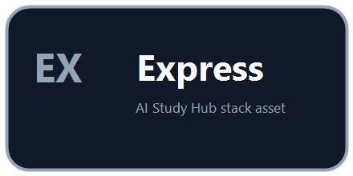
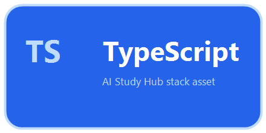
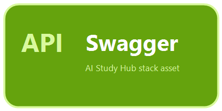
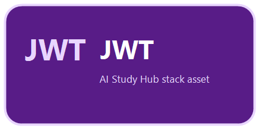
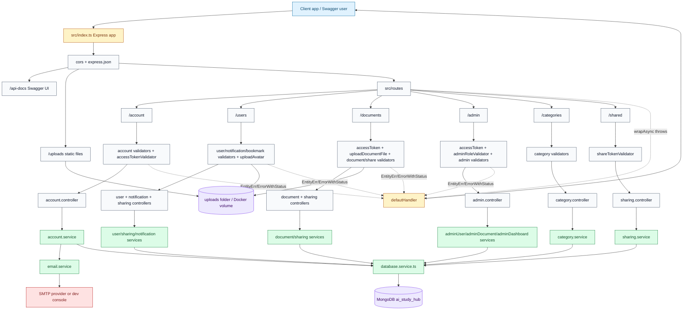
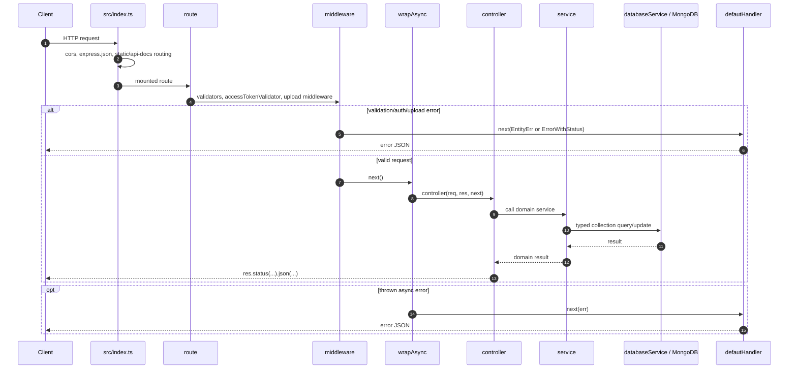
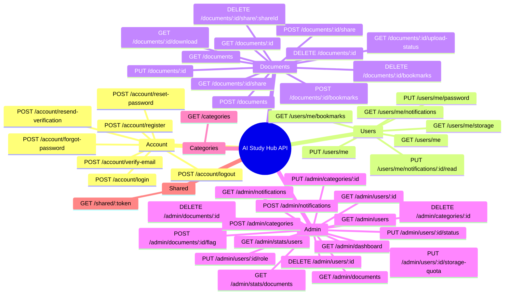
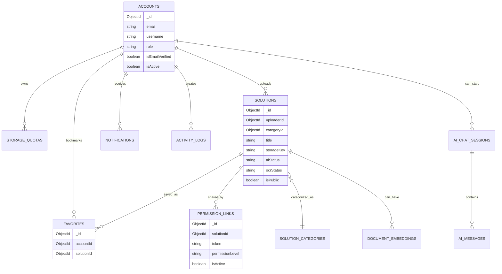
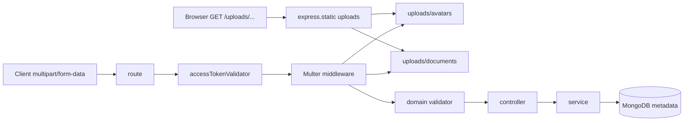
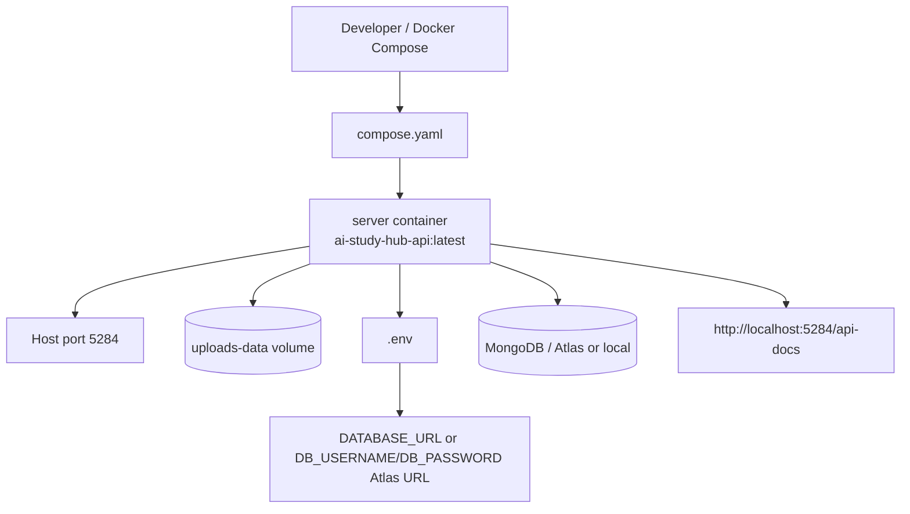

# AI Study Hub - System Architecture

Tai lieu nay mo ta kien truc backend hien tai cua AI Study Hub dua tren source code trong `src/`, cac docs san co trong `docs/`, va Docker handoff hien tai. Muc tieu la co mot file de dua vao Mermaid Live Editor, Markdown preview, hoac dung lam handoff cho nguoi ve system architecture diagram.

## Quick Assets

Các asset nhỏ dưới đây là badge local tự tạo để minh hoạ stack trong tài liệu. Đây không phải logo chính thức của vendor.

<p>
  
  
  
  
  
  
  
  
</p>

Standalone Mermaid file: [docs/diagrams/system-architecture.mmd](./diagrams/system-architecture.mmd)

## Stack Runtime

| Layer | Công nghệ / file chính | Vai trò |
| --- | --- | --- |
| Runtime | Node.js + Express 5, `src/index.ts` | Khởi tạo app, middleware, routes, Swagger, static files, error handler |
| Language | TypeScript, `tsc && tsc-alias` | Compile source từ `src/` sang `dist/` để chạy production |
| Validation | `express-validator`, `src/utils/validation.ts` | Validate body/query/params/headers, gom lỗi field thành `EntityErr` |
| Auth | JWT, `src/utils/jwt.ts`, `accessTokenValidator` | Decode bearer token và gán payload vào request |
| Upload | Multer, `src/middlewares/upload.middlewares.ts` | Lưu avatar/document vào `uploads/avatars` và `uploads/documents` |
| Docs | `swagger-jsdoc`, `swagger-ui-express`, `src/swagger.ts` | Sinh OpenAPI từ comment `@swagger` trong route files |
| Database | MongoDB native driver, `src/services/database.service.ts` | Một `MongoClient`, typed collection getters, index cho favorites/share token |
| Email | Nodemailer, `src/services/email.service.ts` | Gửi OTP qua SMTP hoặc log ra console khi dev thiếu SMTP config |
| Deploy | `Dockerfile`, `compose.yaml` | Build production image, expose port `5284`, mount `uploads-data` volume |

## Main System Diagram



## Request Lifecycle



## Mounted API Surface

| Mount | Route file | Main controllers | Domain services | Main storage |
| --- | --- | --- | --- | --- |
| `/account` | `account.route.ts` | `account.controller.ts` | `account.service.ts`, `email.service.ts` | `accounts` |
| `/users` | `user.route.ts` | `user.controller.ts`, `notification.controller.ts`, `sharing.controller.ts` | `user.service.ts`, `notification.service.ts`, `sharing.service.ts` | `accounts`, `storage_quotas`, `favorites`, `notifications` |
| `/documents` | `document.route.ts` | `document.controller.ts`, `sharing.controller.ts` | `document.service.ts`, `sharing.service.ts` | `solutions`, `solution_categories`, `favorites`, `permission_links`, `storage_quotas`, `activity_logs`, `uploads/documents` |
| `/admin` | `admin.route.ts` | `admin.controller.ts` | `adminUser.service.ts`, `adminDocument.service.ts`, `adminDashboard.service.ts`, `category.service.ts`, `notification.service.ts` | most collections |
| `/categories` | `category.route.ts` | `category.controller.ts` | `category.service.ts` | `solution_categories`, `solutions` |
| `/shared` | `shared.route.ts` | `sharing.controller.ts` | `sharing.service.ts` | `permission_links`, `solutions`, `accounts` |
| `/uploads` | `src/index.ts` | none | none | local `uploads/` folder |
| `/api-docs` | `src/index.ts`, `src/swagger.ts` | none | none | Swagger schema generated from route comments |

## Current Route Groups



## Database Architecture

`database.service.ts` tạo một `MongoClient` bằng `DATABASE_URL`, chọn DB theo `DB_NAME`, rồi expose typed collection getters. Code hiện tại tạo index cho:

- `favorites`: unique `{ accountId: 1, solutionId: 1 }`
- `permission_links`: unique `{ token: 1 }`



Collections exposed today:

| Getter | MongoDB collection | Main usage |
| --- | --- | --- |
| `accounts` | `accounts` | auth, profile, admin users, uploaders |
| `storageQuotas` | `storage_quotas` | storage plan and usage tracking |
| `activityLogs` | `activity_logs` | document/admin/category/notification audit entries |
| `solutions` | `solutions` | documents, OCR/AI status, soft delete, download count |
| `solutionCategories` | `solution_categories` | categories and document grouping |
| `aiChatSessions` | `ai_chat_sessions` | AI chat data model and admin stats basis |
| `aiMessages` | `ai_messages` | AI messages data model and admin stats basis |
| `documentEmbeddings` | `document_embeddings` | future/internal RAG embeddings |
| `aiConfigurations` | `ai_configurations` | AI configuration model |
| `permissionLinks` | `permission_links` | public share links |
| `favorites` | `favorites` | bookmarks |
| `notifications` | `notifications` | admin fan-out and user notification inbox |

## Upload And Static File Flow



Avatar upload accepts `.jpg`, `.jpeg`, `.png` up to 2 MB. Document upload accepts `.pdf`, `.docx`, `.txt` up to 100 MB. File metadata and business state are stored in MongoDB, while binary files are stored on local disk or the Docker named volume `uploads-data`.

## Deployment View



Production command path:

```txt
npm run build -> dist/ -> npm start -> node dist/index.js
```

Development command path:

```txt
npm run dev -> tsx watch src/index.ts
```

## Architecture Notes

- `src/index.ts` is the runtime composition root. It connects MongoDB, registers CORS, JSON parser, `/uploads`, `/api-docs`, all domain routes, then `defautHandler`.
- Routes stay thin: choose method/path, attach validators/auth/upload middleware, then wrap controller with `wrapAsync`.
- Controllers should only translate request data into service calls and HTTP responses.
- Services own business rules, MongoDB queries, email sending orchestration, storage quota updates, bookmark/share behavior, notifications, and admin dashboards.
- The repo uses MongoDB native driver, not Mongoose. Schema files are TypeScript classes/interfaces for document shape, not Mongoose models.
- `ai_chat_sessions`, `ai_messages`, `document_embeddings`, and `ai_configurations` exist in the model/database layer, but no separate `/chat` router is mounted in the current `src/index.ts`.
- OCR currently appears as document state fields in `solutions`; there is no separate OCR worker/process mounted in this Express app.
- Error flow is centralized through `ErrorWithStatus`, `EntityErr`, `wrapAsync`, and `defautHandler`.

## Suggested Diagram Export

1. Open [docs/diagrams/system-architecture.mmd](./diagrams/system-architecture.mmd).
2. Paste it into Mermaid Live Editor or a Markdown preview that supports Mermaid.
3. Export SVG/PNG for slides or reports.
4. Keep this Markdown file as the readable architecture handoff.
