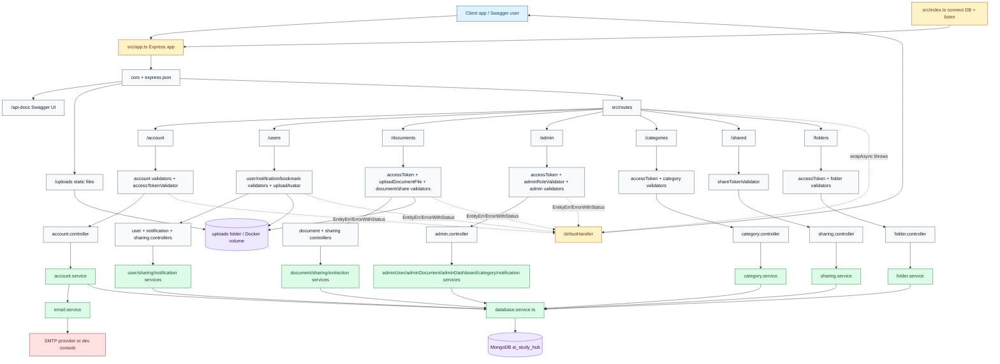
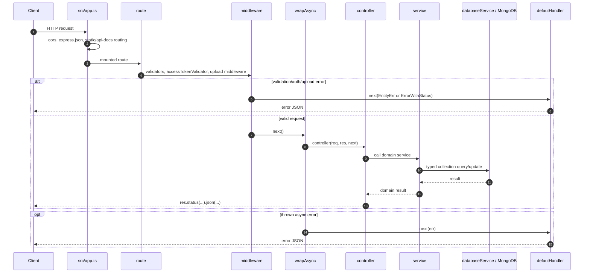
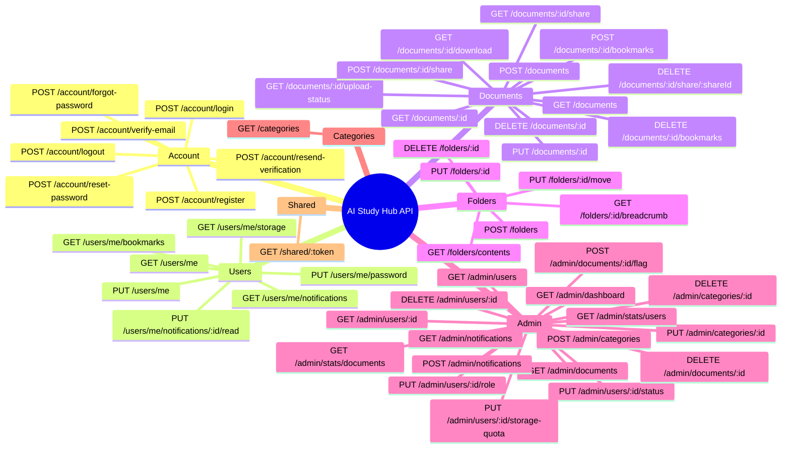
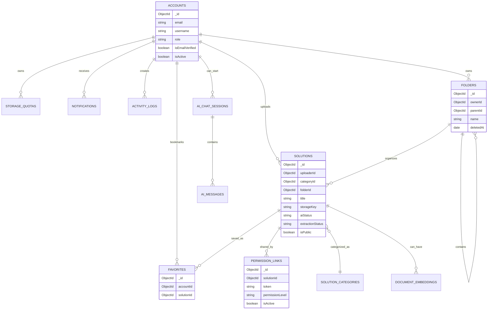
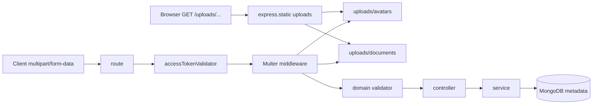
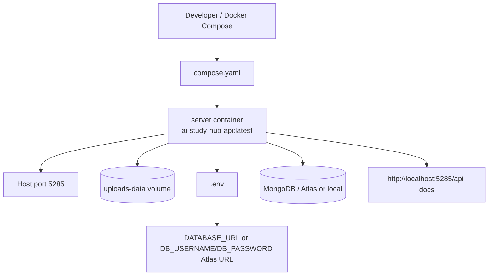

# AI Study Hub - System Architecture

Tài liệu này mô tả kiến trúc backend hiện tại của AI Study Hub dựa trên source code trong `src/`. Mục tiêu là làm tài liệu handoff (bàn giao) cho người hoặc agent khác trước khi nghiên cứu, bổ sung, hoặc sửa code.

> Quy tắc đọc quan trọng: khi tài liệu cũ và source code bị lệch nhau, ưu tiên source code hiện tại. File nên kiểm tra đầu tiên là `src/app.ts`, sau đó mới đến route, middleware, controller và service.

## Quick Assets

Các asset nhỏ dưới đây là badge local tự tạo để minh họa stack trong tài liệu. Đây không phải logo chính thức của vendor.

<p>
  
  
  
  
  
  
  
  
</p>

Standalone Mermaid file: [docs/diagrams/system-architecture.mmd](./diagrams/system-architecture.mmd)

## Stack Runtime

| Layer           | Công nghệ / file chính                                    | Vai trò                                                                                                                                               |
| --------------- | --------------------------------------------------------- | ----------------------------------------------------------------------------------------------------------------------------------------------------- |
| Bootstrap       | `src/index.ts`                                            | Kết nối MongoDB bằng `databaseService.connect()`, sau đó gọi `app.listen(...)`.                                                                       |
| App config      | Node.js + Express 5, `src/app.ts`                         | Tạo Express app, mount middleware, static file, Swagger, route và error handler.                                                                      |
| Language        | TypeScript, `tsc && tsc-alias`                            | Compile source từ `src/` sang `dist/` để chạy production.                                                                                             |
| Validation      | `express-validator`, `src/utils/validation.ts`            | Validate body/query/params/headers và gom lỗi field thành `EntityErr`.                                                                                |
| Auth            | JWT, `src/utils/jwt.ts`, `accessTokenValidator`           | Decode bearer token và gán payload vào request.                                                                                                       |
| Upload          | Multer, `src/middlewares/upload.middlewares.ts`           | Lưu avatar/document vào `uploads/avatars` và `uploads/documents`.                                                                                     |
| Docs            | `swagger-jsdoc`, `swagger-ui-express`, `src/swagger.ts`   | Sinh OpenAPI từ comment `@swagger` trong route files.                                                                                                 |
| Database        | MongoDB native driver, `src/services/database.service.ts` | Một `MongoClient`, typed collection getters, index cơ bản cho favorites/share token/folders/documents.                                                |
| Email           | Nodemailer, `src/services/email.service.ts`               | Gửi OTP qua SMTP hoặc log ra console khi dev thiếu SMTP config.                                                                                       |
| Service helpers | `src/services/helpers/helper.service.ts`                  | Gom helper dùng chung trong service layer như parse boolean, pagination, ObjectId, soft-delete filter, account access, storage quota và activity log. |
| Deploy          | `Dockerfile`, `compose.yaml`                              | Build production image, expose port `5285`, mount `uploads-data` volume.                                                                              |

## App Split Hiện Tại

`src/index.ts` không còn là nơi cấu hình Express app. File này chỉ làm bootstrap:

```txt
src/index.ts
  -> import app từ src/app.ts
  -> await databaseService.connect()
  -> app.listen(Base.port)
```

`src/app.ts` mới là nơi cấu hình app:

```txt
src/app.ts
  -> cors
  -> express.json()
  -> /uploads static files
  -> /api-docs Swagger
  -> /account, /users, /documents, /admin, /categories, /shared, /folders
  -> GET /
  -> defautHandler
```

Tách như vậy giúp integration test (test API qua Supertest) import `app` mà không mở port thật và không connect DB thêm lần nữa.

## Main System Diagram



## Request Lifecycle



## Mounted API Surface

| Mount         | Route file                     | Main controllers                                                            | Domain services                                                                                                                   | Main storage                                                                                                                |
| ------------- | ------------------------------ | --------------------------------------------------------------------------- | --------------------------------------------------------------------------------------------------------------------------------- | --------------------------------------------------------------------------------------------------------------------------- |
| `/account`    | `account.route.ts`             | `account.controller.ts`                                                     | `account.service.ts`, `email.service.ts`                                                                                          | `accounts`                                                                                                                  |
| `/users`      | `user.route.ts`                | `user.controller.ts`, `notification.controller.ts`, `sharing.controller.ts` | `user.service.ts`, `notification.service.ts`, `sharing.service.ts`                                                                | `accounts`, `storage_quotas`, `favorites`, `notifications`                                                                  |
| `/documents`  | `document.route.ts`            | `document.controller.ts`, `sharing.controller.ts`                           | `document.service.ts`, `sharing.service.ts`, `extraction.service.ts`                                                              | `solutions`, `solution_categories`, `favorites`, `permission_links`, `storage_quotas`, `activity_logs`, `uploads/documents` |
| `/admin`      | `admin.route.ts`               | `admin.controller.ts`                                                       | `adminUser.service.ts`, `adminDocument.service.ts`, `adminDashboard.service.ts`, `category.service.ts`, `notification.service.ts` | most collections                                                                                                            |
| `/categories` | `category.route.ts`            | `category.controller.ts`                                                    | `category.service.ts`                                                                                                             | `solution_categories`, `solutions`                                                                                          |
| `/shared`     | `shared.route.ts`              | `sharing.controller.ts`                                                     | `sharing.service.ts`                                                                                                              | `permission_links`, `solutions`, `accounts`                                                                                 |
| `/folders`    | `folder.route.ts`              | `folder.controller.ts`                                                      | `folder.service.ts`                                                                                                               | `folders`, `solutions`, `storage_quotas`, `favorites`, `permission_links`                                                   |
| `/uploads`    | `src/app.ts`                   | none                                                                        | none                                                                                                                              | local `uploads/` folder                                                                                                     |
| `/api-docs`   | `src/app.ts`, `src/swagger.ts` | none                                                                        | none                                                                                                                              | Swagger schema generated from route comments                                                                                |

## Current Route Groups



## Database Architecture

`database.service.ts` tạo một `MongoClient` bằng `DATABASE_URL`, chọn DB theo `DB_NAME`, rồi expose typed collection getters. Code hiện tại tạo index cho:

- `favorites`: unique `{ accountId: 1, solutionId: 1 }`
- `permission_links`: unique `{ token: 1 }`
- `folders`: `{ ownerId: 1, parentId: 1, createdAt: -1 }`
- `folders`: `{ ownerId: 1, parentId: 1, name: 1 }`
- `solutions`: `{ uploaderId: 1, folderId: 1, createdAt: -1 }`



Collections exposed today:

| Getter               | MongoDB collection    | Main usage                                                    |
| -------------------- | --------------------- | ------------------------------------------------------------- |
| `accounts`           | `accounts`            | auth, profile, admin users, uploaders                         |
| `storageQuotas`      | `storage_quotas`      | storage plan and usage tracking                               |
| `activityLogs`       | `activity_logs`       | document/admin/category/notification audit entries            |
| `solutions`          | `solutions`           | documents, extraction/AI status, soft delete, download count  |
| `folders`            | `folders`             | personal parent-reference folder tree and cascade soft delete |
| `solutionCategories` | `solution_categories` | categories and document grouping                              |
| `aiChatSessions`     | `ai_chat_sessions`    | AI chat data model and admin stats basis                      |
| `aiMessages`         | `ai_messages`         | AI messages data model and admin stats basis                  |
| `documentEmbeddings` | `document_embeddings` | future/internal RAG embeddings                                |
| `aiConfigurations`   | `ai_configurations`   | AI configuration model                                        |
| `permissionLinks`    | `permission_links`    | public share links                                            |
| `favorites`          | `favorites`           | bookmarks                                                     |
| `notifications`      | `notifications`       | admin fan-out and user notification inbox                     |

## Upload And Static File Flow



Avatar upload accepts `.jpg`, `.jpeg`, `.png` up to 2 MB.

Document upload accepts `.pdf`, `.docx`, `.txt`, `.md`, `.jpg`, `.jpeg`, `.png`, `.webp` up to 100 MB. Metadata and business state are stored in MongoDB, while binary files are stored on local disk or the Docker named volume `uploads-data`.

Important note: `/uploads` is served as static files. Static file nghĩa là file có thể được Express phục vụ trực tiếp nếu client biết đúng đường dẫn.

## Text Extraction

Text extraction (trích xuất chữ có sẵn trong file số) chạy trong `extraction.service.ts` khi upload document:

- `.pdf`: dùng `pdf-parse`.
- `.docx`: dùng `mammoth`.
- `.txt` và `.md`: đọc nội dung UTF-8.
- `.jpg`, `.jpeg`, `.png`, `.webp`: không OCR trong v1, lưu `extractionStatus = skipped`.

OCR là nhận dạng chữ từ ảnh hoặc scan. Source hiện tại chưa có OCR thật.

Blind spot hiện tại: extraction đang chạy inline trong `POST /documents`, nên file lớn có thể làm request upload lâu hoặc timeout. Hướng target là chuyển sang async worker:

```txt
POST /documents
  -> lưu file + metadata
  -> set extractionStatus = pending
  -> tạo extraction job
  -> trả response ngay

document extraction worker
  -> xử lý digital extraction/OCR nền
  -> update solutions.extractionStatus + extractedText
```

Chi tiết kế hoạch nằm ở [docs/plans/async-extraction-ocr.md](../plans/async-extraction-ocr.md).

Lưu ý dung lượng text: phase đơn giản có thể lưu text trong `solutions.extractedText`, nhưng nếu text/OCR dài thì nên chỉ lưu preview ở `solutions` và chia full text vào collection `document_text_chunks`. Kế hoạch chi tiết nằm ở [docs/plans/text-chunking-plan.md](../plans/text-chunking-plan.md).

## Deployment View



Production command path:

```txt
npm run build -> dist/ -> npm start -> node dist/index.js
```

Development command path:

```txt
npm run dev -> tsx watch src/index.ts
```

## Architecture Notes

- `src/app.ts` là Express composition root (nơi lắp middleware, static files, Swagger, routes, error handler).
- `src/index.ts` là bootstrap root (nơi connect DB và mở port).
- Routes stay thin: chọn method/path, attach validators/auth/upload middleware, rồi wrap controller bằng `wrapAsync`.
- Controllers chỉ nên chuyển request data thành service call và HTTP response.
- Services giữ business rules (quy tắc nghiệp vụ), MongoDB queries, email sending, storage quota, bookmark/share, notifications và admin dashboard.
- `src/services/helpers/helper.service.ts` chứa helper dùng chung cho service layer. Helper này chỉ gom logic lặp như parse, `ObjectId`, filter soft-delete, account active/verified, document access, storage quota và activity log; không thay thế domain service.
- Folder organization tách khỏi category: `folders.parentId` tạo cây thư mục cá nhân, còn `solutions.folderId` đặt document vào cây đó.
- Folder delete là owner-only và validator yêu cầu `{ confirm: true }`. Tuy nhiên controller hiện không truyền `confirm` xuống service, nên service chưa enforce lại điều kiện này. Đây là một điểm cần sửa code hoặc ghi rõ là contract hiện tại dựa vào middleware.
- Project dùng MongoDB native driver, không dùng Mongoose. Schema files là TypeScript classes/interfaces cho document shape, không phải Mongoose models.
- `ai_chat_sessions`, `ai_messages`, `document_embeddings`, và `ai_configurations` đã có ở model/database layer, nhưng chưa có `/chat` router hoặc `/admin/ai-settings` router trong runtime hiện tại.
- Error flow tập trung qua `ErrorWithStatus`, `EntityErr`, `wrapAsync`, và `defautHandler`.

## Suggested Diagram Export

1. Open [docs/diagrams/system-architecture.mmd](./diagrams/system-architecture.mmd).
2. Paste it into Mermaid Live Editor or a Markdown preview that supports Mermaid.
3. Export SVG/PNG for slides or reports.
4. Keep this Markdown file as readable architecture handoff.
