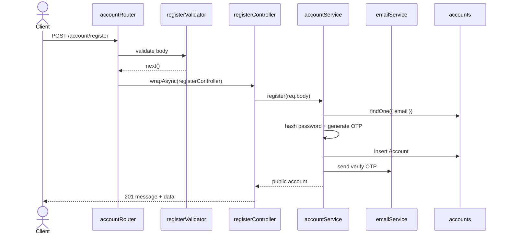
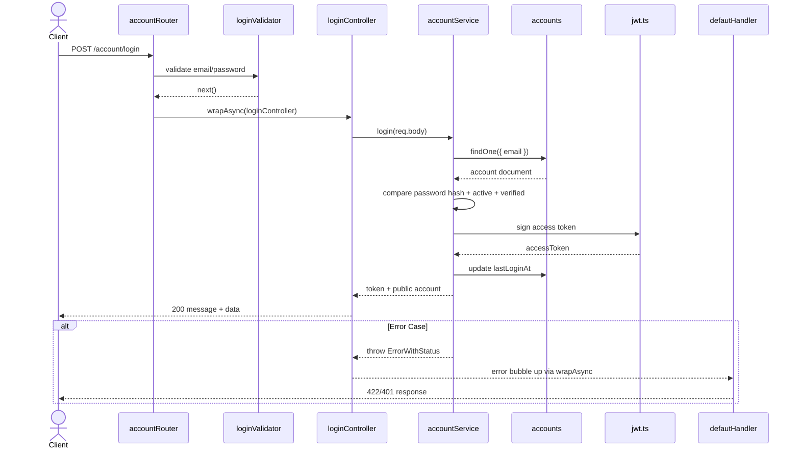

# 01 - Authentication

Nhóm này gồm US01 và US02, phụ trách đăng ký, xác thực email, đăng nhập, đăng xuất, quên mật khẩu và đặt lại mật khẩu. Code hiện tại nằm trong:

- `src/routes/account.route.ts`
- `src/middlewares/account.middlewares.ts`
- `src/controllers/account.controller.ts`
- `src/services/account.service.ts`
- `src/models/request/account.request.ts`
- collection `accounts`

OTP nghĩa là one-time password (mã dùng một lần). Source hiện tại dùng OTP cho verify email và reset password.

## Endpoint Map

| US   | Method | Endpoint                       | Auth   | Trạng thái  | Body chính                                       |
| ---- | ------ | ------------------------------ | ------ | ----------- | ------------------------------------------------ |
| US01 | POST   | `/account/register`            | No     | Implemented | `username`, `email`, `password`, `fullName`      |
| US01 | POST   | `/account/verify-email`        | No     | Implemented | `email`, `otp`                                   |
| US01 | POST   | `/account/resend-verification` | No     | Implemented | `email`                                          |
| US02 | POST   | `/account/login`               | No     | Implemented | `email`, `password`                              |
| US02 | POST   | `/account/logout`              | Bearer | Implemented | none                                             |
| US02 | POST   | `/account/forgot-password`     | No     | Implemented | `email`                                          |
| US02 | POST   | `/account/reset-password`      | No     | Implemented | `email`, `otp`, `newPassword`, `confirmPassword` |

## Schema Và Collection Flow

- Request DTO: `RegisterReqBody`, `LoginReqBody`, `VerifyEmailReqBody`, `ForgotPasswordReqBody`, `ResetPasswordReqBody`.
- Schema: `Account`.
- Collection: `databaseService.accounts`.
- Token payload: `TokenPayLoad` gồm `user_id` và `token_type`.
- Password hash: `hashPassword(...)`.
- Email service: `email.service.ts` gửi OTP qua SMTP hoặc log ra console nếu thiếu SMTP config.

## Request Processing Flow

1. Route gắn validator từ `account.middlewares.ts`.
2. Controller async được bọc bằng `wrapAsync`.
3. Validator kiểm tra body/header và decode JWT nếu endpoint cần token.
4. Controller lấy body hoặc decoded token từ `req`.
5. Controller gọi `accountService`.
6. Service normalize email bằng `toLowerCase().trim()`.
7. Service query/update collection `accounts`.
8. Nếu lỗi validation field, `validate(...)` gom thành `EntityErr` 422.
9. Nếu lỗi nghiệp vụ có status riêng, service hoặc validator throw `ErrorWithStatus`.
10. `defautHandler` trả JSON lỗi cuối cùng.

## Luồng Đăng Ký



## Luồng Verify Email Hiện Tại

Code hiện tại là:

```txt
POST /account/verify-email
body: { email, otp }
```

Không phải:

```txt
GET /account/verify-email?token=...
```

Luồng xử lý:

1. `emailVerifyOtpValidator` validate `email` và `otp`.
2. `emailVerifyController` gọi `accountService.verifyEmailOtp(req.body)`.
3. Service tìm account theo email đã normalize.
4. Service so khớp `emailVerifyOtp` và thời hạn `emailVerifyOtpExpiresAt`.
5. Nếu hợp lệ, set `isEmailVerified = true`, clear OTP fields.

## Luồng Login



## Luồng Forgot/Reset Password Hiện Tại

Forgot password:

```txt
POST /account/forgot-password
body: { email }
```

Reset password:

```txt
POST /account/reset-password
body: { email, otp, newPassword, confirmPassword }
```

Điểm cần nhớ:

- Forgot password luôn trả response thành công để hạn chế email enumeration (đoán xem email có tồn tại hay không).
- Nếu account tồn tại, service tạo forgot password OTP và gửi email/log console.
- Reset password kiểm tra email, OTP, thời hạn OTP, rồi update `passwordHash`.
- Sau khi reset xong, service clear forgot password OTP fields.

## Business Rules

- Register không insert raw `...payload`; service map request sang `Account` schema và set `passwordHash`, OTP fields.
- Email truyền vào validator phải không có leading/trailing spaces vì `express-validator` chạy `isEmail` trước `trim` trong cùng field.
- Service vẫn normalize email lại ở tầng business logic.
- Login yêu cầu account active và đã verify email.
- Logout hiện tại stateless: chỉ validate access token rồi trả success, chưa có token blacklist.
- Access token validator đọc header `Authorization: Bearer <token>`.
- Access token phải có `token_type = TokenType.AccessToken`.

## Test Cases Nên Có

- Register email mới thành công.
- Register duplicate email trả 422.
- Verify email OTP đúng thành công.
- Verify email OTP sai hoặc hết hạn trả lỗi.
- Resend verification với email chưa verify tạo OTP mới.
- Login sai password trả 422.
- Login account inactive/not verified trả 401.
- Logout thiếu token hoặc token sai trả 401.
- Forgot password không lộ email có tồn tại hay không.
- Reset password OTP đúng đổi mật khẩu thành công.
- Reset password OTP sai/hết hạn trả lỗi.

## Conflict Đã Sửa So Với Docs Cũ

- Docs cũ ghi `GET /account/verify-email?token=...`; source hiện tại là `POST /account/verify-email` với `email + otp`.
- Docs cũ nhắc `EmailVerificationToken`; source hiện tại verify email bằng OTP lưu trong account.
- Docs cũ mô tả reset password bằng token; source hiện tại reset bằng `email + otp + newPassword + confirmPassword`.
