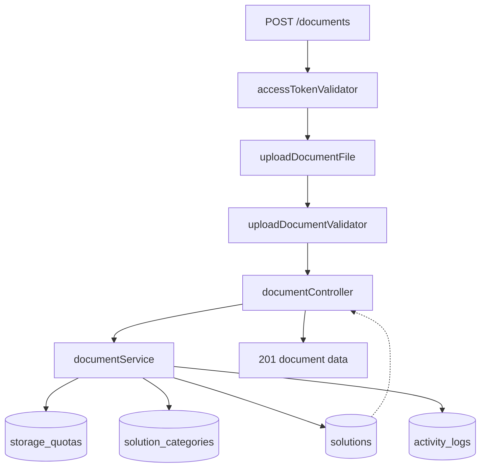
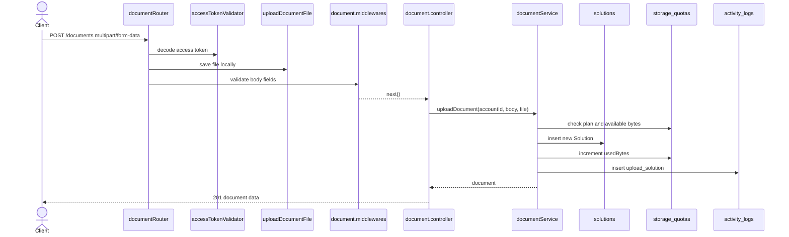

# 03 - Document Management

Nhóm này gồm US03, US04, US05, US06, US07 và US08. Đây là core của AI Study Hub: upload tài liệu, xem danh sách, xem chi tiết, tìm kiếm, lọc, chỉnh sửa metadata, xoá mềm và tải xuống.

## Endpoint Map

| US   | Method | Endpoint                        | Auth   | Trang thai           |
| ---- | ------ | ------------------------------- | ------ | -------------------- |
| US03 | POST   | `/documents`                    | Bearer | Implemented          |
| US03 | GET    | `/documents/{id}/upload-status` | Bearer | Planned              |
| US04 | GET    | `/documents`                    | Bearer | Implemented          |
| US04 | GET    | `/documents/{id}`               | Bearer | Implemented          |
| US04 | GET    | `/documents/{id}/download`      | Bearer | Planned              |
| US05 | DELETE | `/documents/{id}`               | Bearer | Planned              |
| US06 | PUT    | `/documents/{id}`               | Bearer | Implemented          |
| US07 | GET    | `/documents?q=...`              | Bearer | Implemented via list |
| US08 | GET    | `/documents?categoryId=...`     | Bearer | Implemented via list |

## Schema Và Collection Flow

- Request DTO: `UploadDocumentReqBody`, `GetDocumentsQuery`, `UpdateDocumentReqBody`.
- Schema: `Solution`, `SolutionCategory`, `StorageQuota`, `ActivityLog`, `Favorite`, `PermissionLink`.
- Collections: `solutions`, `solution_categories`, `storage_quotas`, `activity_logs`, `favorites`, `permission_links`.
- Upload middleware: `uploadDocumentFile` lưu local file vào `uploads/documents`.

## Request Processing Flow

1. `accessTokenValidator` decode user từ bearer token.
2. Upload endpoint chạy multer trước, sau đó validator check title/category/tags/isPublic/enableOcr.
3. `documentService.uploadDocument` check account active/verified, quota, category active, tạo `Solution`, update quota, ghi `activity_logs`.
4. List endpoint tạo Mongo filter theo owner/public, not deleted, search regex, tags, category, status, pagination.
5. Detail endpoint check owner/public, tăng `viewCount`, join category/uploader/favorite/share count.
6. Update endpoint chỉ owner mới được sửa metadata, sau đó ghi audit action `update_solution_meta`.

## Sơ đồ Luồng Xử lý

## Ảnh Tham khảo

Nguồn: [Wikimedia Commons - Cloud storage architecture](https://commons.wikimedia.org/wiki/File:Cloud_storage_architecture.png)

## Business Rules

- User chỉ thấy tài liệu của mình hoặc tài liệu public.
- Soft-deleted document bị loại khỏi list/detail.
- Upload phải tồn trong quota và max file size của plan.
- `categoryId` nếu có phải là ObjectId hợp lệ và category active.
- `tags` update theo cơ chế ghi để hoàn toàn.
- Xoá planned sế set `deletedAt`, `deletedBy`, `autoDeleteAt`, không hard delete.

## Test Cases

- Upload file hợp lệ, sai định dạng, vượt quota.
- List có `q`, `categoryId`, `tags`, `isPublic`, `page`, `limit`.
- Detail owner/public xem được, private non-owner bị 403.
- Update non-owner bị 403; owner update và có activity log.
