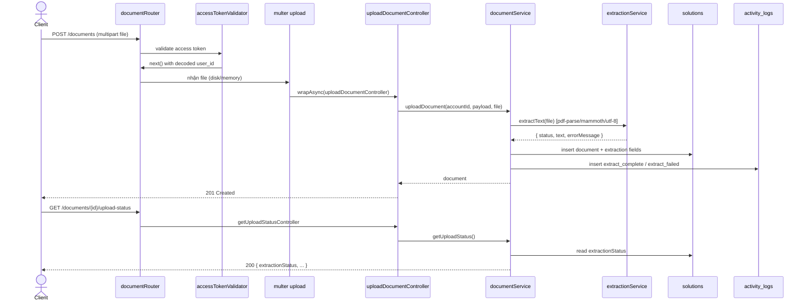

<!-- Sẽ đổi tên file thành 04-cloud-preview-extraction.md: text extraction đã được thay bằng text extraction tự động khi upload -->

# 04 - Cloud Storage, Preview Và Text Extraction

Nhóm này gồm US09 và US14. Trong API spec, preview gắn trực tiếp với document; text extraction chạy **tự động khi upload** (không còn endpoint text extraction riêng). Hiện tại code có local upload trong `uploads/documents` và đã trích xuất text từ tài liệu digital ngay khi upload; cloud adapter và preview endpoint chưa implement.

## Endpoint Map

| US   | Method | Endpoint                        | Auth   | Trang thai  |
| ---- | ------ | ------------------------------- | ------ | ----------- |
| US09 | GET    | `/documents/{id}/preview`       | Bearer | Planned     |
| US14 | (auto) | chạy trong `POST /documents`    | Bearer | Implemented |
| US14 | GET    | `/documents/{id}/upload-status` | Bearer | Implemented |

> Không còn `POST /documents/{id}/extraction` và `GET /documents/{id}/extraction`. Trích xuất text diễn ra ngay trong luồng upload; trạng thái xem qua `GET /documents/{id}/upload-status`.

## Schema Và Collection Flow

- Schema: `Solution`, `DocumentEmbedding`, `ActivityLog`.
- Collections: `solutions`, `document_embeddings`, `activity_logs`.
- Text extraction fields nằm inline trong `solutions`: `extractionStatus`, `extractedText`, `extractedAt`, `extractionErrorMessage`.
- Preview dùng metadata file: `storageProvider`, `storageBucket`, `storageKey`, `publicUrl`, `mimeType`.

## Engine Trích Xuất

- `.pdf` → `pdf-parse`
- `.docx` → `mammoth`
- `.txt` → đọc UTF-8

> Đây là **text extraction**, không phải text extraction. PDF scan/ảnh không có text layer sẽ cho `extractedText` rỗng nhưng `extractionStatus = completed` (không có bước text extraction dự phòng).

## Request Processing Flow

1. Validate access token và document id (preview).
2. Service load document từ `solutions`, check owner/public/share permission.
3. Preview endpoint tạo signed URL hoặc trả local file URL tùy storage provider.
4. **Text extraction (trong upload):** sau khi nhận file, service đọc nội dung theo phần mở rộng, gọi engine tương ứng, set `extractionStatus`, `extractedText`, `extractedAt`, `extractionErrorMessage` rồi lưu cùng document. Ghi `activity_logs` `extract_complete`/`extract_failed`.
5. Theo dõi trạng thái qua `GET /documents/{id}/upload-status` (trả `extractionStatus`, `extractionErrorMessage`).
6. Khi `extractionStatus = completed`, search document dùng `extractedText`.

## Sơ đồ Luồng Xử lý

## Ảnh Tham khảo

Nguồn: [Wikimedia Commons - Cloud storage architecture](https://commons.wikimedia.org/wiki/File:Cloud_storage_architecture.png)

## Business Rules

- Preview không được bypass owner/public/share rules.
- Text extraction không tạo collection riêng; status và kết quả nằm inline trong `solutions`.
- Extraction failed phải lưu `extractionErrorMessage` để admin logs có thể query; lỗi extraction **không** được làm hỏng luồng upload (document vẫn được tạo).
- Khi extraction completed, search document có thể dùng `extractedText`.

## Test Cases

- Preview private document non-owner bị 403.
- Upload `.txt`/`.pdf`/`.docx` digital → `extractionStatus = completed`, `extractedText` có nội dung.
- Upload PDF scan không có text layer → `extractionStatus = completed`, `extractedText` rỗng.
- Engine lỗi → `extractionStatus = failed` + `extractionErrorMessage`, document vẫn được tạo.
- `GET /documents/{id}/upload-status` trả đúng `extractionStatus`.
