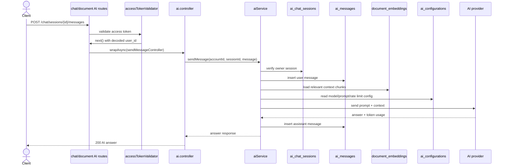

# 05 - AI Chat Và Document AI

Nhóm này gồm US10, US11, US12 và US13. Mục tiêu là tạo chat session, gửi tin nhắn AI, tóm tắt tài liệu, giải thích khái niệm, xem lịch sử và xoá session. Hiện tại mới có schema và collection getter; endpoint chưa implement.

## Endpoint Map

| US        | Method | Endpoint                       | Auth   | Trang thai |
| --------- | ------ | ------------------------------ | ------ | ---------- |
| US10/US12 | POST   | `/chat/sessions`               | Bearer | Planned    |
| US10/US12 | POST   | `/chat/sessions/{id}/messages` | Bearer | Planned    |
| US11      | POST   | `/documents/{id}/ai/summarize` | Bearer | Planned    |
| US12      | POST   | `/documents/{id}/ai/explain`   | Bearer | Planned    |
| US13      | GET    | `/chat/sessions`               | Bearer | Planned    |
| US13      | GET    | `/chat/sessions/{id}/messages` | Bearer | Planned    |
| US13      | DELETE | `/chat/sessions/{id}`          | Bearer | Planned    |

## Schema Và Collection Flow

- Schema: `AiChatSession`, `AiMessage`, `DocumentEmbedding`, `Solution`, `StorageQuota`, `AiConfiguration`.
- Collections: `ai_chat_sessions`, `ai_messages`, `document_embeddings`, `solutions`, `storage_quotas`, `ai_configurations`.
- Enums: `AiChatSessionType`, `AiMessageRole`, `AiStatus`, `AiConfigurationCategory`.

## Request Processing Flow

1. Auth validator decode account id.
2. Service check document access nếu chat/summarize/explain gắn với tài liệu.
3. Tạo session trong `ai_chat_sessions` hoặc load session hiện có.
4. Lưu user message vào `ai_messages`.
5. Lấy context từ `document_embeddings` nếu document có AI ready/OCR text.
6. Gửi AI provider bằng config trong `ai_configurations`.
7. Lưu assistant message, tăng usage/quota, trả response.

## Sơ đồ Luồng Xử lý

## Ảnh Tham khảo

Nguồn: [Wikimedia Commons - Full GPT architecture](https://commons.wikimedia.org/wiki/File:Full_GPT_architecture.svg)

## Business Rules

- Chỉ owner của session mới xem/gửi/xoá session.
- AI gắn với document phải check document access trước khi lấy embeddings.
- Cần check quota/rate limit trước khi gửi AI provider.
- Failed AI call sẽ trả lỗi có status rõ và không làm mất user message nếu đã insert.

## Test Cases

- Tạo session với document public/private.
- Gửi message khi session không phải của user trả 403.
- Summarize/explain document không có OCR/embedding cần fallback hoặc lỗi rõ.
- List messages phân trang đúng thứ tự thời gian.
