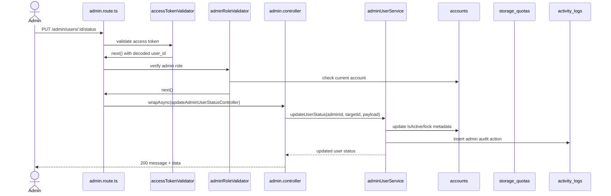

# 07 - Admin User Management

Nhóm này gồm US19, dành cho admin quản lý tài khoản: xem danh sách, xem chi tiết, khóa/mở khóa, cập nhật role, cập nhật quota và xóa mềm user. Source hiện tại đã implement trong `/admin`.

Code chính:

- `src/routes/admin.route.ts`
- `src/middlewares/admin.middlewares.ts`
- `src/controllers/admin.controller.ts`
- `src/services/adminUser.service.ts`
- `src/services/database.service.ts`

## Endpoint Map

| US   | Method | Endpoint                         | Auth         | Trạng thái  |
| ---- | ------ | -------------------------------- | ------------ | ----------- |
| US19 | GET    | `/admin/users`                   | Admin Bearer | Implemented |
| US19 | GET    | `/admin/users/:id`               | Admin Bearer | Implemented |
| US19 | PUT    | `/admin/users/:id/status`        | Admin Bearer | Implemented |
| US19 | PUT    | `/admin/users/:id/role`          | Admin Bearer | Implemented |
| US19 | PUT    | `/admin/users/:id/storage-quota` | Admin Bearer | Implemented |
| US19 | DELETE | `/admin/users/:id`               | Admin Bearer | Implemented |

## Schema Và Collection Flow

- Schema: `Account`, `StorageQuota`, `ActivityLog`.
- Collections: `accounts`, `storage_quotas`, `activity_logs`, `solutions`.
- Enums: `UserRole`, `StoragePlan`, `ActivityAction`, `ActivityEntityType`.

## Request Processing Flow

1. `accessTokenValidator` decode access token.
2. `adminRoleValidator` load account hiện tại và kiểm tra `role = admin`, active, verified.
3. Validator kiểm tra params/query/body.
4. Controller lấy `admin_id` từ decoded token và gọi `adminUserService`.
5. Service query/update `accounts` và `storage_quotas`.
6. Các thao tác quan trọng ghi `activity_logs`.
7. Response không trả `passwordHash`, OTP fields hoặc token fields.

## Sơ Đồ Luồng Xử Lý

## Business Rules

- Tất cả endpoint cần admin role, không chỉ Bearer token.
- List users hỗ trợ filter `q`, `role`, `status`, `plan`, pagination và sort.
- Detail user có thêm quota và các count liên quan.
- Soft delete user set inactive/deleted metadata, không hard delete record.
- Service chặn admin tự xóa hoặc khóa chính mình trong các case nguy hiểm.
- Service có logic tránh xóa/hạ quyền admin cuối cùng.
- Update quota sync vào `storage_quotas` theo `accountId`.

## Test Cases Nên Có

- User thường gọi admin endpoint bị chặn.
- List users có pagination/filter.
- Get detail user trả quota/document count.
- Lock user làm login tiếp theo bị chặn.
- Update role/quota có activity log.
- Không cho tự xóa/tự khóa tài khoản admin đang dùng.
- Không cho xóa hoặc hạ quyền admin cuối cùng.
