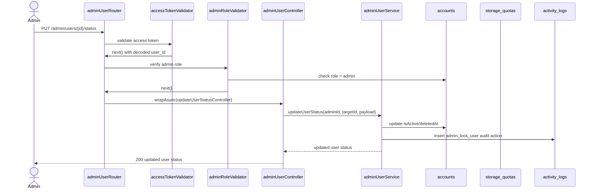

# 07 - Admin User Management

Nhóm này gồm US19, dành cho admin quản lý tài khoản: xem danh sách, xem chi tiết, khóa/mở khóa, cập nhật role, cập nhật quota và xoá mềm user. Hiện tại endpoint admin users chưa implement.

## Endpoint Map

| US   | Method | Endpoint                          | Auth         | Trang thai |
| ---- | ------ | --------------------------------- | ------------ | ---------- |
| US19 | GET    | `/admin/users`                    | Admin Bearer | Planned    |
| US19 | GET    | `/admin/users/{id}`               | Admin Bearer | Planned    |
| US19 | PUT    | `/admin/users/{id}/status`        | Admin Bearer | Planned    |
| US19 | PUT    | `/admin/users/{id}/role`          | Admin Bearer | Planned    |
| US19 | PUT    | `/admin/users/{id}/storage-quota` | Admin Bearer | Planned    |
| US19 | DELETE | `/admin/users/{id}`               | Admin Bearer | Planned    |

## Schema Và Collection Flow

- Schema: `Account`, `StorageQuota`, `ActivityLog`.
- Collections: `accounts`, `storage_quotas`, `activity_logs`.
- Enums: `UserRole`, `StoragePlan`, `ActivityAction`, `ActivityEntityType`.

## Request Processing Flow

1. Auth validator decode access token.
2. Admin role middleware planned load account và check `role=admin`.
3. Validator check params/query/body.
4. Service query/update `accounts` và `storage_quotas`.
5. Mỗi thao tác admin quan trọng ghi `activity_logs`.
6. Response không trả `passwordHash`, token fields hay secret provider info.

## Sơ đồ Luồng Xử lý

## Ảnh Tham khảo

Nguồn: [Wikimedia Commons - Web API diagram](https://commons.wikimedia.org/wiki/File:Web_API_diagram.svg)

## Business Rules

- Tất cả endpoint cần admin role, không chỉ bearer token.
- Soft delete user set `deletedAt`/`isActive=false`, không hard delete.
- Không cho admin tự xoá/khóa chính mình nếu đây là admin cuối cùng.
- Cập nhật quota phải sync `storage_quotas` theo `accountId`.

## Test Cases

- User thường gọi admin endpoint bị 403.
- List users có pagination/filter.
- Lock user làm login tiếp theo bị chặn.
- Update role/quota có activity log.
