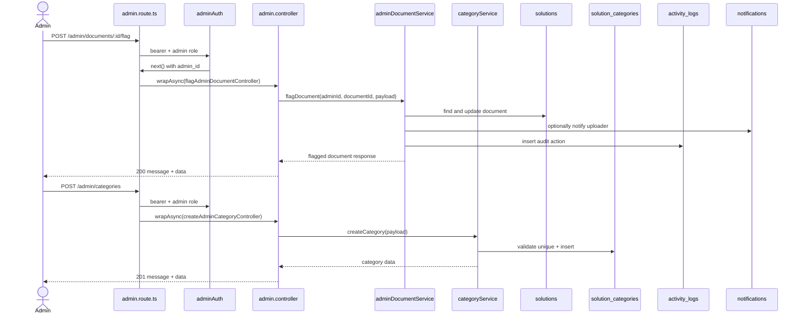

# 08 - Admin Documents Và Categories

Nhóm này gồm US20 và US21. Admin quản lý tất cả tài liệu, xóa tài liệu vi phạm, đánh dấu vi phạm và CRUD category. Source hiện tại đã implement các route này.

Code chính:

- `src/routes/admin.route.ts`
- `src/routes/category.route.ts`
- `src/middlewares/admin.middlewares.ts`
- `src/middlewares/category.middlewares.ts`
- `src/controllers/admin.controller.ts`
- `src/controllers/category.controller.ts`
- `src/services/adminDocument.service.ts`
- `src/services/category.service.ts`

## Endpoint Map

| US   | Method | Endpoint                    | Auth         | Trạng thái  |
| ---- | ------ | --------------------------- | ------------ | ----------- |
| US20 | GET    | `/admin/documents`          | Admin Bearer | Implemented |
| US20 | POST   | `/admin/documents/:id/flag` | Admin Bearer | Implemented |
| US20 | DELETE | `/admin/documents/:id`      | Admin Bearer | Implemented |
| US21 | GET    | `/categories`               | Bearer       | Implemented |
| US21 | POST   | `/admin/categories`         | Admin Bearer | Implemented |
| US21 | PUT    | `/admin/categories/:id`     | Admin Bearer | Implemented |
| US21 | DELETE | `/admin/categories/:id`     | Admin Bearer | Implemented |

## Schema Và Collection Flow

- Schema: `Solution`, `SolutionCategory`, `ActivityLog`, `Notification`.
- Collections: `solutions`, `solution_categories`, `activity_logs`, `notifications`, `storage_quotas`.
- Enums: `SolutionStatus`, `SolutionCategoryType`, `ActivityAction`, `NotificationType`.

## Request Processing Flow

1. Admin document/category write endpoints check token + admin role.
2. Admin list documents query `solutions` không giới hạn owner.
3. List documents hỗ trợ filter `q`, `uploaderId`, `categoryId`, `isPublic`, `extractionStatus`, `aiStatus`, `status`, `flagged`.
4. Flag document update flag metadata và có thể tạo notification cho uploader.
5. Delete document là soft delete, giảm quota của uploader và có thể notify uploader.
6. `GET /categories` hiện cần Bearer token, không phải public.
7. Category service check name/slug unique ở tầng service.
8. Delete category nếu đang có document dùng category thì cần `migrateTo`, nếu không sẽ bị chặn.

## Sơ Đồ Luồng Xử Lý

## Business Rules

- Admin document delete là soft delete để còn audit trail.
- Admin flag document không xóa document ngay.
- Delete document phải giảm `storage_quotas.usedBytes` của uploader.
- Category đang được document sử dụng không được xóa thẳng nếu không có `migrateTo`.
- `GET /categories` trả category list kèm `documentCount`.
- Tất cả hành động admin quan trọng nên ghi `activity_logs`.

## Test Cases Nên Có

- Non-admin bị chặn.
- Admin list thấy document theo filter.
- Flag document tăng flag count và có log.
- Delete document soft delete và giảm quota.
- Create category duplicate name/slug bị chặn.
- Delete category đang được dùng không có `migrateTo` bị chặn.
- Delete category có `migrateTo` update document sang category mới.
