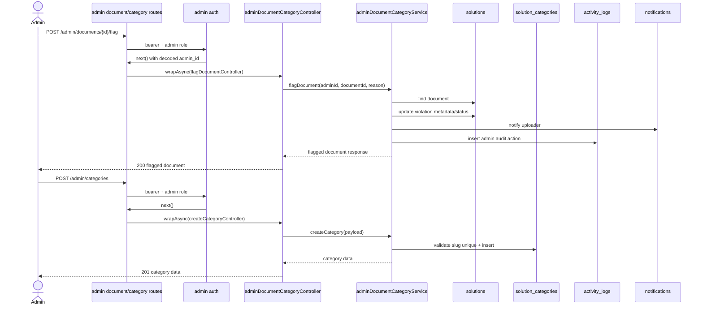

# 08 - Admin Documents Và Categories

Nhóm này gồm US20 và US21. Admin quản lý tất cả tài liệu, xoá tài liệu vi phạm, đánh dấu vi phạm và CRUD danh mục. Endpoint chưa implement trong `src`.

## Endpoint Map

| US   | Method | Endpoint                     | Auth                  | Trang thai |
| ---- | ------ | ---------------------------- | --------------------- | ---------- |
| US20 | GET    | `/admin/documents`           | Admin Bearer          | Planned    |
| US20 | DELETE | `/admin/documents/{id}`      | Admin Bearer          | Planned    |
| US20 | POST   | `/admin/documents/{id}/flag` | Admin Bearer          | Planned    |
| US21 | GET    | `/categories`                | Bearer/Public planned | Planned    |
| US21 | POST   | `/admin/categories`          | Admin Bearer          | Planned    |
| US21 | PUT    | `/admin/categories/{id}`     | Admin Bearer          | Planned    |
| US21 | DELETE | `/admin/categories/{id}`     | Admin Bearer          | Planned    |

## Schema Và Collection Flow

- Schema: `Solution`, `SolutionCategory`, `ActivityLog`, `Notification`.
- Collections: `solutions`, `solution_categories`, `activity_logs`, `notifications`.
- Enums: `SolutionStatus`, `SolutionCategoryType`, `ActivityAction`, `NotificationType`.

## Request Processing Flow

1. Admin document endpoints check token + admin role.
2. Admin list documents query `solutions` không giới hạn owner, có filter status/category/uploader/violation.
3. Delete violation set soft-delete fields hoặc status archived/error, ghi reason.
4. Flag endpoint update metadata/status planned và có thể gửi notification cho uploader.
5. Category public list chỉ trả active categories.
6. Admin category CRUD thao tác `solution_categories`, cần check slug/name unique.

## Sơ đồ Luồng Xử lý

## Ảnh Tham khảo

Nguồn: [Wikimedia Commons - Client-server model](https://commons.wikimedia.org/wiki/File:Client-server-model.svg)

## Business Rules

- Admin document delete là soft delete để còn audit trail.
- Category đang được document sử dụng nên có policy rõ: chặn delete hoặc set inactive.
- Category system có thể không cho user/admin xoá tùy rule.
- Tất cả hành động admin nên ghi `activity_logs`.

## Test Cases

- Non-admin bị 403.
- Admin list thấy cả public/private/deleted theo filter.
- Delete/flag document tạo notification cho uploader.
- Delete category đang được dùng phải có behavior rõ.
