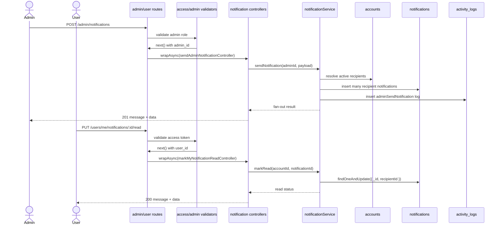

# 09 - Notifications

Nhóm này gồm US22. Admin có thể gửi thông báo hệ thống theo fan-out, user xem inbox và đánh dấu đã đọc. Source hiện tại đã implement.

Fan-out nghĩa là từ một lần gửi, hệ thống tạo nhiều bản ghi notification cho nhiều người nhận.

Code chính:

- `src/routes/admin.route.ts`
- `src/routes/user.route.ts`
- `src/middlewares/notification.middlewares.ts`
- `src/controllers/admin.controller.ts`
- `src/controllers/notification.controller.ts`
- `src/services/notification.service.ts`

## Endpoint Map

| US   | Method | Endpoint                           | Auth         | Trạng thái  |
| ---- | ------ | ---------------------------------- | ------------ | ----------- |
| US22 | POST   | `/admin/notifications`             | Admin Bearer | Implemented |
| US22 | GET    | `/admin/notifications`             | Admin Bearer | Implemented |
| US22 | GET    | `/users/me/notifications`          | Bearer       | Implemented |
| US22 | PUT    | `/users/me/notifications/:id/read` | Bearer       | Implemented |

## Schema Và Collection Flow

- Schema: `Notification`, `Account`, `ActivityLog`.
- Collections: `notifications`, `accounts`, `activity_logs`.
- Enums: `NotificationType`, `NotificationRefEntity`, `NotificationPriority`, `ActivityAction`.

## Request Processing Flow

1. Admin send notification validate target: `all` hoặc `recipientIds`.
2. Service resolve recipients từ `accounts`.
3. Service tạo `sourceEventId` chung cho một batch gửi.
4. Service insert nhiều `notifications`, mỗi recipient một record.
5. Service ghi `activity_logs`.
6. Admin history group notification theo `sourceEventId`.
7. User inbox query notification theo `recipientId`.
8. Mark read chỉ update notification của chính user.

## Sơ Đồ Luồng Xử Lý

## Business Rules

- Target `all` chỉ lấy active accounts.
- Target `specific` phải resolve đủ `recipientIds`, thiếu id thì trả lỗi.
- User không được đọc/mark read notification của user khác.
- Admin history trả theo batch `sourceEventId`.
- `sendEmail` hiện được lưu/log trong metadata, chưa gửi email thật.

## Test Cases Nên Có

- Send to all active users.
- Send to specific recipientIds.
- Send với recipientIds không tồn tại trả lỗi.
- User inbox có pagination và unread count.
- Mark read notification của user khác bị chặn.
- Admin history group đúng theo `sourceEventId`.
