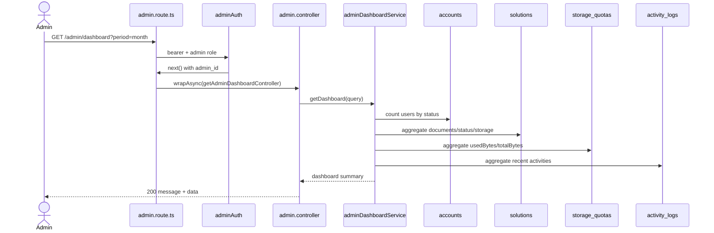

# 10 - Admin Dashboard Và Statistics

Nhóm này gồm US23, cung cấp dashboard và thống kê chi tiết về users/documents. Source hiện tại đã implement.

Code chính:

- `src/routes/admin.route.ts`
- `src/middlewares/admin.middlewares.ts`
- `src/controllers/admin.controller.ts`
- `src/services/adminDashboard.service.ts`

## Endpoint Map

| US   | Method | Endpoint                 | Auth         | Trạng thái  |
| ---- | ------ | ------------------------ | ------------ | ----------- |
| US23 | GET    | `/admin/dashboard`       | Admin Bearer | Implemented |
| US23 | GET    | `/admin/stats/users`     | Admin Bearer | Implemented |
| US23 | GET    | `/admin/stats/documents` | Admin Bearer | Implemented |

## Schema Và Collection Flow

- Collections: `accounts`, `solutions`, `storage_quotas`, `activity_logs`, `ai_chat_sessions`, `ai_messages`.
- Schema liên quan: `Account`, `Solution`, `StorageQuota`, `ActivityLog`, `AiChatSession`, `AiMessage`.

## Request Processing Flow

1. Validate access token.
2. `adminRoleValidator` kiểm tra current account là admin.
3. Validator kiểm tra query `period`, `from`, `to`, `groupBy`.
4. Controller gọi `adminDashboardService`.
5. Service count/aggregate nhiều collection.
6. Response trả summary hoặc series thống kê cho frontend.

## Sơ Đồ Luồng Xử Lý

## Business Rules

- Chỉ admin được xem dashboard/stats.
- Dashboard hỗ trợ `period` như `today`, `week`, `month`, `year`.
- Stats users/documents hỗ trợ `from`, `to`, `groupBy`.
- Không trả thông tin nhạy cảm như password hash/token.
- Service nên dùng count/aggregate thay vì load toàn bộ collection vào memory.

## Test Cases Nên Có

- Non-admin bị chặn.
- Dashboard default period.
- Dashboard theo `period`.
- Stats users theo `from/to/groupBy`.
- Stats documents theo `from/to/groupBy`.
- Response không lộ field nhạy cảm.
