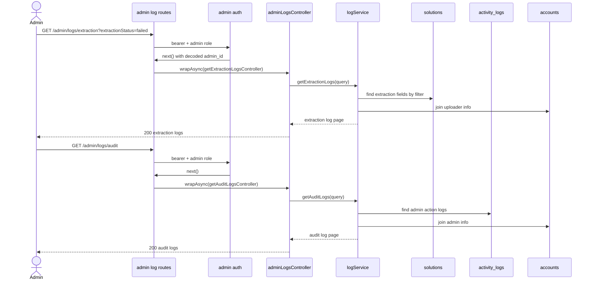

# 12 - Admin System Logs

Nhóm này gồm US25, cho admin xem log trích xuất văn bản (text extraction), log hệ thống và audit trail. Endpoint chưa implement trong `src`, nhưng schema `ActivityLog` và text extraction fields trong `Solution` đã có.

## Endpoint Map

| US   | Method | Endpoint                 | Auth         | Trang thai |
| ---- | ------ | ------------------------ | ------------ | ---------- |
| US25 | GET    | `/admin/logs/extraction` | Admin Bearer | Planned    |
| US25 | GET    | `/admin/logs/system`     | Admin Bearer | Planned    |
| US25 | GET    | `/admin/logs/audit`      | Admin Bearer | Planned    |

## Schema Và Collection Flow

- Text extraction logs query từ `solutions` theo `extractionStatus`, `extractedAt`, `extractionErrorMessage`.
- System/audit logs query từ `activity_logs` (action `extract_complete`, `extract_failed`, ...).
- Có thể join `accounts` để hiển thị admin/uploader basic info.

## Request Processing Flow

1. Admin auth check.
2. Extraction logs build filter trên `solutions`: `extractionStatus`, from/to theo `extractedAt`.
3. System logs build filter trên `activity_logs`: action, entityType, accountId, from/to.
4. Audit logs là subset của `activity_logs` với admin actions.
5. Response có data + pagination meta.

## Sơ đồ Luồng Xử lý

## Ảnh Tham khảo

Nguồn: [Wikimedia Commons - Web API diagram](https://commons.wikimedia.org/wiki/File:Web_API_diagram.svg)

## Business Rules

- Log endpoints chỉ admin được truy cập.
- Text extraction logs không có collection riêng; đọc từ `solutions`.
- Audit logs nên lọc action admin như lock user, delete solution admin, update AI config.
- Pagination bắt buộc để tránh response quá lớn.

## Test Cases

- Extraction log failed/completed/processing.
- System log filter theo action/account/entityType.
- Audit log chỉ trả admin actions.
- Non-admin bị 403.
