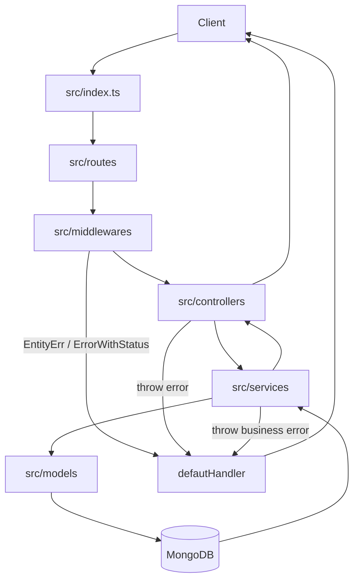

# Endpoint Flow Docs

Thư mục này tách các User Story và endpoint trong `docs/DescriptionProject.md` thành nhiều file nhỏ theo nhóm chức năng. Mỗi file tập trung vào hướng xử lý backend: validate input, controller lấy dữ liệu, service xử lý nghiệp vụ, truy vấn MongoDB qua `databaseService`, handle lỗi, và trả response.

Nguồn tham chiếu chính:

- `docs/ContextProject.md`: bối cảnh, mục tiêu và scope sản phẩm.
- `docs/DescriptionProject.md`: API contract tổng.
- `docs/validations.md`: quy ước validation, `wrapAsync`, `ErrorWithStatus`, `EntityErr`, `defautHandler`.
- `src/`: hiện trạng code thật của Express + TypeScript + MongoDB native driver.

## Cách Đọc

Mỗi file có cùng một khung:

- Endpoint map: US, method, path, auth, trạng thái code hiện tại.
- Schema/collection flow: request DTO, schema class, collection liên quan.
- Request processing flow: các bước từ client đến response.
- Business rules và error handling.
- Sơ đồ Mermaid và ảnh tham khảo có nguồn.

## Trạng Thái Hiện Tại

| File                               | US         | Nhóm                       | Trạng thái  |
| ---------------------------------- | ---------- | -------------------------- | ----------- |
| `01-authentication.md`             | US01, US02 | Auth account               | Implemented |
| `02-user-profile-storage.md`       | US15, US16 | Profile + quota            | Partial     |
| `03-document-management.md`        | US03-US08  | Tài liệu cơ bản            | Partial     |
| `04-cloud-preview-ocr.md`          | US09, US14 | Preview + OCR              | Planned     |
| `05-ai-chat-document-ai.md`        | US10-US13  | AI chat/doc AI             | Planned     |
| `06-bookmarks-sharing.md`          | US17, US18 | Bookmark + sharing         | Planned     |
| `07-admin-users.md`                | US19       | Admin users                | Planned     |
| `08-admin-documents-categories.md` | US20, US21 | Admin documents/categories | Planned     |
| `09-notifications.md`              | US22       | Notifications              | Planned     |
| `10-admin-dashboard-statistics.md` | US23       | Dashboard/stats            | Planned     |
| `11-admin-ai-settings.md`          | US24       | AI settings                | Planned     |
| `12-admin-system-logs.md`          | US25       | Logs/audit                 | Planned     |

## Sơ Đồ Tổng Quan

## Ảnh Tham Khảo

Nguồn: [Wikimedia Commons - Web API diagram](https://commons.wikimedia.org/wiki/File:Web_API_diagram.svg)

## Ghi Chú Về Mermaid

GitHub Markdown hỗ trợ render Mermaid trong file `.md`, nên các block `mermaid` trong thư mục này có thể hiển thị thành diagram khi xem trên GitHub hoặc Markdown preview có Mermaid support. Xem thêm `image-sources.md` để biết nguồn ảnh web và lý do chọn.
