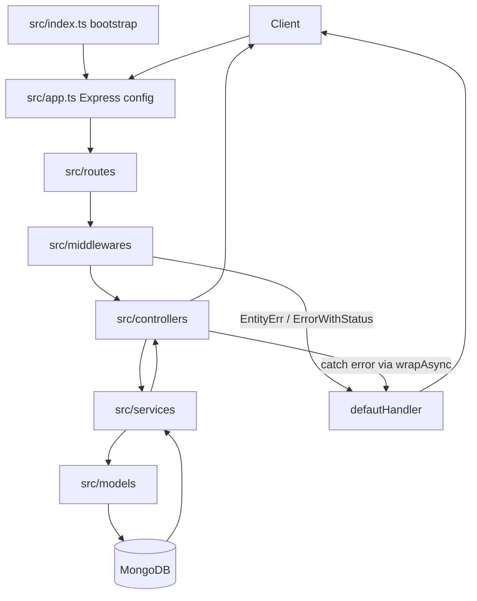

# Endpoint Flow Docs

Thư mục này tách các nhóm endpoint thành nhiều file nhỏ theo chức năng. Mỗi file tập trung vào hướng xử lý backend: route (đường dẫn API), middleware (lớp xử lý trước controller), controller (lớp nhận request/trả response), service (lớp xử lý nghiệp vụ), MongoDB collection và error flow (luồng lỗi).

## Nguồn Tham Chiếu Chính

- `src/app.ts`: nguồn đúng nhất để biết route nào đang được mount trong runtime (trạng thái chạy thật).
- `src/routes/*.ts`: nguồn đúng nhất để biết method/path/auth/middleware của từng endpoint.
- `src/controllers/*.ts`: nguồn đúng nhất để biết controller gọi service nào và response trả về ra sao.
- `src/services/*.ts`: nguồn đúng nhất để biết business rule (quy tắc nghiệp vụ) và query MongoDB.
- `docs/architecture/validation-error-flow.md`: quy ước validation, `wrapAsync`, `ErrorWithStatus`, `EntityErr`, `defautHandler`.
- `AGENTS.MD`: coding guide tổng hợp cho agent.

> Lưu ý: `docs/architecture/api-specification.md` mô tả phạm vi rất rộng gồm cả tính năng đã làm và tính năng tương lai. Khi nghiên cứu code hiện tại, phải đối chiếu lại với `src/app.ts` và `src/routes`.

## Cách Đọc

Mỗi file flow nên có cùng một khung:

- Endpoint map: US, method, path, auth, trạng thái code hiện tại.
- Schema/collection flow: request DTO, schema class, collection liên quan.
- Request processing flow: các bước từ client đến response.
- Business rules và error handling.
- Mermaid diagram nếu flow đủ phức tạp.
- Test cases hoặc gợi ý test.

## Trạng Thái Hiện Tại Theo Source

| File                               | US         | Nhóm                       | Trạng thái theo source hiện tại | Ghi chú                                                                                                |
| ---------------------------------- | ---------- | -------------------------- | ------------------------------- | ------------------------------------------------------------------------------------------------------ |
| `01-authentication.md`             | US01, US02 | Auth account               | Implemented                     | Verify/reset dùng OTP, không dùng email verification token route.                                      |
| `02-user-profile-storage.md`       | US15, US16 | Profile + quota            | Implemented                     | Có profile, avatar, đổi mật khẩu, storage quota fallback free plan.                                    |
| `03-document-management.md`        | US03-US08  | Tài liệu cơ bản            | Implemented                     | Có upload, list/search/filter, detail, update, soft delete, download, upload status.                   |
| `04-cloud-preview-extraction.md`   | US09, US14 | Preview + Text Extraction  | Partial                         | Text extraction đã có nhưng đang inline; cần refactor async theo `docs/plans/async-extraction-ocr.md`. |
| `05-ai-chat-document-ai.md`        | US10-US13  | AI chat/doc AI             | Planned                         | Có model/collection AI, chưa có `/chat` router.                                                        |
| `06-bookmarks-sharing.md`          | US17, US18 | Bookmark + sharing         | Implemented                     | Share public token đã có; `requiresLogin` và `passwordHash` chưa enforce.                              |
| `07-admin-users.md`                | US19       | Admin users                | Implemented                     | Có list/detail/status/role/quota/soft delete.                                                          |
| `08-admin-documents-categories.md` | US20, US21 | Admin documents/categories | Implemented                     | Có admin documents, flag/delete, category create/update/delete, user category list.                    |
| `09-notifications.md`              | US22       | Notifications              | Implemented                     | Admin fan-out, admin history, user inbox, mark read.                                                   |
| `10-admin-dashboard-statistics.md` | US23       | Dashboard/stats            | Implemented                     | Có dashboard, user stats, document stats.                                                              |
| `11-admin-ai-settings.md`          | US24       | AI settings                | Planned                         | Có `ai_configurations` model/getter, chưa có route runtime.                                            |
| `12-admin-system-logs.md`          | US25       | Logs/audit                 | Planned/Partial                 | Có `activity_logs` collection và ghi log ở nhiều service; chưa có admin logs route riêng.              |
| `13-folders.md`                    | Extra      | Folder management          | Implemented                     | Có folder tree, contents, breadcrumb, rename, move, cascade soft delete.                               |

## Sơ Đồ Tổng Quan

## Quy Ước Khi Cập Nhật Flow Docs

- Không ghi một endpoint là implemented nếu chưa có trong `src/routes`.
- Nếu model/collection đã có nhưng route chưa có, ghi là planned hoặc partial.
- Nếu docs cũ nói Mongoose, cần ghi rõ source hiện tại dùng MongoDB native driver.
- Nếu flow có behavior (hành vi) chưa enforce ở service, phải ghi rõ. Ví dụ share link có `passwordHash` nhưng public resolver hiện chưa kiểm tra password.
- Nếu source và docs lệch nhau, thêm mục `Conflict hoặc lưu ý` thay vì âm thầm bỏ qua.

## Ảnh Tham Khảo

Nguồn: [Wikimedia Commons - Web API diagram](https://commons.wikimedia.org/wiki/File:Web_API_diagram.svg)

## Ghi Chú Về Mermaid

GitHub Markdown hỗ trợ render Mermaid trong file `.md`, nên các block `mermaid` trong thư mục này có thể hiển thị thành diagram khi xem trên GitHub hoặc Markdown preview có Mermaid support. Xem thêm `docs/assets/image-sources.md` để biết nguồn ảnh web và lý do chọn.
